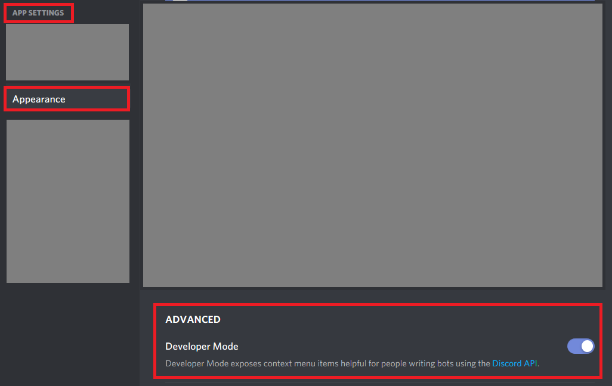

# Discord Unranked Alert Example Application

Make sure you read [the general example README](../../README.md) first.

There are unlimited ways to deploy applications using `rs2wapy`.
This particular example uses [Heroku](https://www.heroku.com/)
to host the unranked alert bot.

### Directory Structure
Brief explanation of the files in this directory.
```
ranked_alert.py  # example application source code
README.md        # this readme file
requirements.txt # Python dependencies for Heroku
```

### Instructions
Detailed steps on setting up this example application.

#### 1. Setting up GitHub
1. Create a GitHub account at https://github.com/join.

2. Fork this example repository https://github.com/tuokri/rs2wapy-examples.
    
    After forking, you will have a copy of this repository
    in your GitHub account.

#### 2. Setting up Heroku
1. Create a free Heroku account.

    Free Heroku account allows you to setup free dynos with
    550 run hours each month. If you verify your account 
    with a credit card, you'll receive 1000 free dyno hours 
    each month. This means you can run this example application
    24/7 for free on Heroku. A dyno is a worker, which
    executes application code.

2. Verify your Heroku account with a credit card
(optional, but recommended).

#### 3. Create a Discord Webhook
1. Perform the steps in the **'MAKING A WEBHOOK'** section of this article
https://support.discordapp.com/hc/en-us/articles/228383668-Intro-to-Webhooks

2. Give your Webhook a name and a picture and choose the channel.

We will use the *Webhook URL* later in this guide.

_**DO NOT** perform the steps explained in the
'QUICK EXAMPLE: GITHUB WEBHOOK INTEGRATION' section!
Those steps are irrelevant for this example!_

#### 4. Setup example application
1. Enable Discord advanced mode.
    
    

2. Copy desired role ID(s).
    
    Find the role(s) you want to ping when the server
    goes unranked, right click and copy their IDs.
    
        

3. Add role ID(s) to [ranked_alert.py](ranked_alert.py).

    Open the file and look at lines 18 to 28.
    The role IDs are stored in the `PING_DISCORD_ROLES` variable.
    Read the comment lines starting with `#` for instructions.
    
4. In [ranked_alert.py](ranked_alert.py) set `RUN = True`
on line number 9.

5. Save the changes.

#### 5. Deploy on Heroku
1. Create a free dyno.

2. Setup environment variables.

3. Deploy from GitHub.
